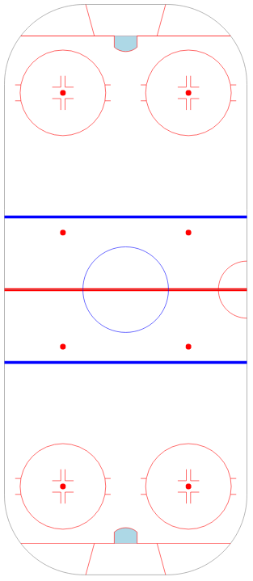
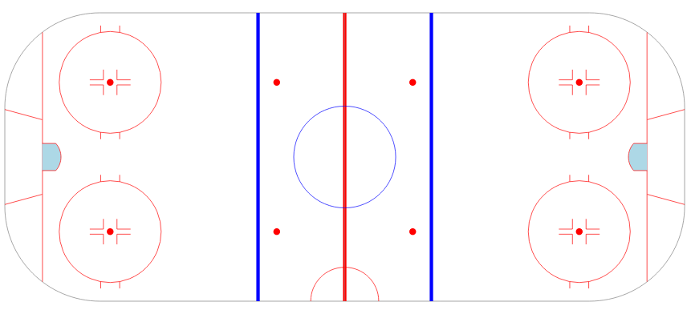
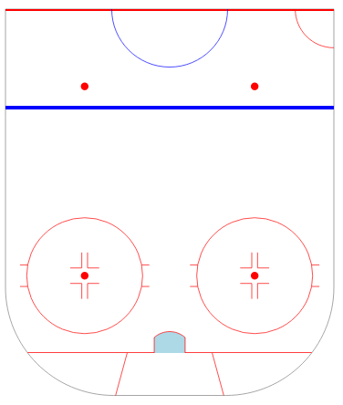
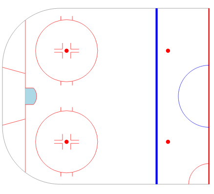

# icerink
Ice rink generated via d3.js

This is intended to be used for any hockey visualizations. The rink is modeled after the current NHL regulation rink markings.

It's configurable to allow for full or half rinks, vertical or horizontal stylings. You can also configure the sizing. Example usage is located in rinks.html.

## Full Rink, Vertical

## Full Rink, Horizontal

## Half Rink, Vertical

## Half Rink, Horizontal
